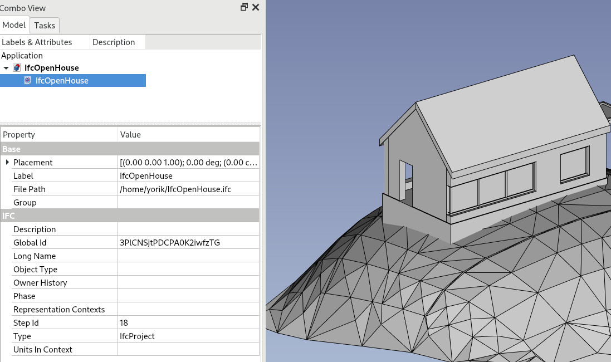

## NativeIFC addon for FreeCAD

This is a preliminary stub to integrate [BlenderBIM](https://blenderbim.org) into [FreeCAD](https://freecad.org). The final goal is to offer in FreeCAD the same level of functionality found in BlenderBIM, mainly the native handling of IFC files, which means the data manipulation in FreeCAD is affecting directly the IFC model.

### Roadmap

#### 1. Get a working concept up

* [x] Write an importer that allows an initial import of an IFC file into FreeCAD
* [x] Write a custom parametric FreeCAD object that represents an IFC document in the FreeCAD tree
* [x] Do an initial geometry import
* [x] Write a custom parametric FreeCAD object that represents in IFC product in the FreeCAD tree
* [x] Reveal the document structure in the FreeCAD tree
* [x] Allow an object shape to be built automatically from its children
* [x] Allow to expand a document (reveal its children)
- [ ] Use group extension
* [ ] Add colors
* [ ] Enable to expand materials and properties

#### 2. Allow basic editing

- [ ] Use enums in enum-based properties
- [ ] Find a way to not store the whole enum in the file
* [ ] Allow to change a parameter of an object
* [ ] Allow different import strategies (full model, only building structure...)
* [ ] Allow different storage strategies (the shape is transient or not, coin representation only, etc..)
* [ ] Write a hook system that allows FreeCAD to save the IFC document
* [ ] Test what happens when opening a bb file in vanilla FreeCAD

- [ ] Add a shape caching system

### Installation & Usage

#### Auto install

*The advantage of this approach is the ability to update FreeCAD-BlenderBIM workbench via the addon manager.* 

* Open the [Addon Manager preferences](https://wiki.freecad.org/Preferences_Editor#Addon_Manager) via `Edit` → `Preferences` → `Addon Manager` → `Custom Repositories`
* Add `https://github.com/yorikvanhavre/FreeCAD-NativeIFC` to `Custom Repositories` list. In the `Branch` section indicate the `main` branch. Press `OK`.
* Start the `Tools` → `Addon Manager` which will automatically find FreeCAD-BlenderBIM addon in the workbench list. 
* Install FreeCAD-NativeIFC addon  
* Restart FreeCAD  
  **Result:** FreeCAD-NativeIFC importer should be available in open/insert file dialogs

#### Manual install

* Navigate to your FreeCAD Mods folder (`~/.local/share/FreeCAD/Mods`)
* Clone this repo there: `git clone https://github.com/yorikvanhavre/FreeCAD-NativeIFC.git`
* Restart FreeCAD  
  **Result:** FreeCAD-NativeIFC importer should be available in open/insert file dialogs

#### To test

* Install the addon as described above
* Restart FreeCAD
* `File` → `Open` or `File` → `Insert`, select an IFC file
* Select the Native IFC importer


* A FreeCAD document is created
* An object is created representing the IFC root document + project



* Right-click the IFC root document object and select **Expand**


* A site object, or any other child object is created. You can further expand those children


### Notes

#### Documentation

* [IfcOpenShell github](https://github.com/IfcOpenShell/IfcOpenShell)
* [IfcOpenShell docs](https://blenderbim.org/docs-python/ifcopenshell.html)
* [BlenderBIM docs](https://blenderbim.org/docs/)
* [IfcOpenShell matrix structure](https://github.com/IfcOpenShell/IfcOpenShell/issues/1440)
* [IfcOpenShell to FreeCAD matrix conversion](https://pythoncvc.net/?cat=203)

#### Code examples

Initial import + getting the main file structure:

```python
import ifcopenshell
ifcfile = ifcopenshell.open("IfcOpenHouse.ifc")
project = ifcfile.by_type("IfcProject")[0]
# get descendants (site, building, and everything inside)
entitieslist = ifcopenshell.util.element.get_decomposition(project)
```

Using the geometry iterator:

```python
from ifcopenshell import geom
import multiprocessing
settings = ifcopenshell.geom.settings()
settings.set(settings.DISABLE_TRIANGULATION, True)
settings.set(settings.USE_BREP_DATA,True)
settings.set(settings.SEW_SHELLS,True)
settings.set(settings.USE_WORLD_COORDS,True)
settings.set(settings.APPLY_LAYERSETS,True)
shapes = []
cores = multiprocessing.cpu_count()-2
iterator = ifcopenshell.geom.iterator(settings, ifcfile, cores, include=entitieslist)
iterator.initialize()
while True:
    item = iterator.get()
    if item:
        ifcproduct = ifcfile.by_id(item.guid)
        brep = item.geometry.brep_data
        shape = Part.Shape()
        shape.importBrepFromString(brep, False)
        shape.scale(1000.0) # IfcOpenShell outputs in meters
        shapes.append(shape)
    if not iterator.next():
        break
compound = Part.makeCompound(shapes)
```

[schependomlaan.ifc](https://github.com/buildingSMART/Sample-Test-Files/blob/master/IFC%202x3/Schependomlaan/Design%20model%20IFC/IFC%20Schependomlaan.ifc) of 47Mb imports in 23s

Change a parameter of an object

```python
cmd = 'attribute.edit_attributes'
prod = ifcfile.by_type["IfcWall"][0]
attribs = {"Name": "Foo"}
ifcopenshell.api.run(cmd, ifcfile, product=prod, attributes=attribs)
```
