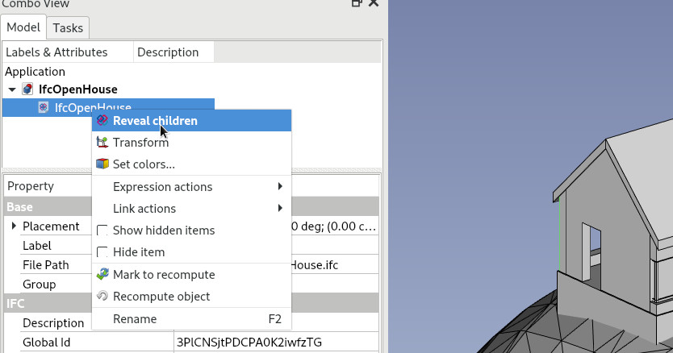
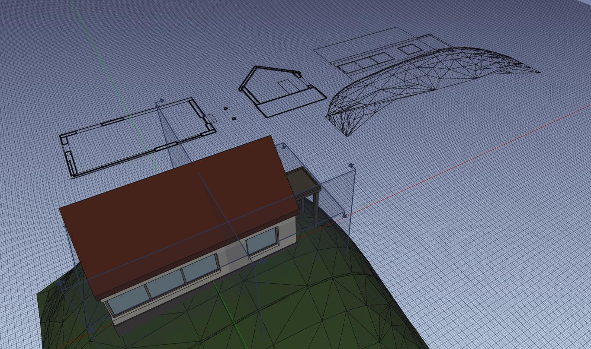

# NativeIFC documentation

This is the documentation of the NativeIFC addon. It is made a of a series of common BIM tasks, and explains simply how to perform each of them with the NativeIFC addon.

### Enabling NativeIFC

    * Install the addon as described above
    * Restart FreeCAD

### Import an IFC file

#### From the UI

    * From menu `File` → `Open` or `File` → `Insert`: choose an IFC file, choose the **NativeIFC** importer
    * From the start page: set "ifc_import" as a [default importer for IFC files](https://wiki.freecad.org/Fine-tuning#Specific_Workbenches), then just click an IFC file

    * Set the desired options. For large files, creating one root object only and no shapes (coin representatipon only) is the fastest way. Objects can have their children and shapes expanded later, as needed. A "no representation" mode is also available, which will load the IFC file structure in the tree, but no 3D representation is created

    * A FreeCAD document is created
    * An object is created representing the IFC root document + project


#### From Python

```python
import ifc_import
ifc_import.open(filepath) # or ifc_import.insert(fileapth,document)
```

### Expand sub-objects of an IFC object

#### From the UI
 
    * Right-click any IFC object on the tree and select **Expand children**

    * A site object, or any other child object is created. You can further expand those children, until there is no more child


#### From Python

```python
import ifc_tools
ifc_tools.create_children(myObject,[recursive=True/False])
```

### Load the shape of an IFC object

#### From  the UI 

Right-click the object in the tree -> load shape

#### From Python

```python
myObject.ShapeMode = "Shape"
myObject.Document.recompute()
```

### Change IFC attributes

#### From the UI

    * Change values like name, description... directly from the object's properties


#### From Python

```python
myObject.Label = "My New Name"
myObject.Description = "A very nice object"
```

### See the changes in an IFC document

#### From the UI

    * Right-click a modified IFC project object in the tree view
    * Select "View diff..."
    * A dialog window pops up showing the modified lines since last saved version

#### From Python

```python
import ifc_diff
# get an existing IFC document object by its name
project = FreeCAD.ActiveDocument.getObject("IfcObject")
ifc_diff.get_diff(project)
```

### Saving the modified IFC file

#### From the UI

    * When any attribute of an object in an IFC document has changed, the icon of the IFC document object shows a red dot, and a **save** option becomes available when right-clicking it
    * Manually: Right-click the project object in the tree -> Save or Save as
    
    * After saving, only the changed parameters have changed in the linked IFC file
    
    * Automatically: Save the FreeCAD document

#### From Python

```python
import ifc_tools
ifc_tools.save(myProject,[filepath=/path/to/somefile.ifc])
```

### Add a new IFC document

#### From the UI

Use the **Project** tool from the BIM workbench

#### From Python

```python
import ifc_tools
doc = FreeCAD.ActiveDocument
ifc_tools.create_document(doc)
```

### Modifying the IFC type of an object

#### From the UI

Change the type directly from the object's properties

#### From Python

```python
myObject.Type = "IfcWall"
```

### Add a new model structure

#### From the UI

    * Switch to the BIM workbench
    * Create a Project object
    * Create a Site object
    * Drag the site onto the project
    * Create a Building object
    * Drag the building onto the site
    * Create a Level object
    * Drag the level onto the building

#### From Python

```python
import ifc_tools
import Arch
doc = FreeCAD.ActiveDocument
project = ifc_tools.create_document(doc)
site = Arch.makeSite()
site = ifc_tools.aggregate(site, project)
building = Arch.makeBuilding()
building = ifc_tools.aggregate(building, site)
level = Arch.makeFloor()
level = ifc_tools.aggregate(floor, building)
```

### Add a new object

#### From the UI

    * Create any desired object with other FreeCAD tools, ex. a wall with the BIM workbench
    * In the tree view, drag that wall onto an IFC project object or a building structure element (Building, storey,...)

#### From Python

```python
# create an object with any other workbench
import Arch
wall = Arch.makeWall(220,400,20)
# get an existing IFC document object by its name
project = FreeCAD.ActiveDocument.getObject("IfcObject")

import ifc_tools
ifc_tools.aggregate(wall, project)
```

### Changing the schema of an IFC document

#### From the UI

Change the 'Schema' property of the object

#### From Python

```python
myProject.Schema = "IFC4"
```

### Create 2D drawings (plans, sections) from an IFC file

#### From the UI

    * Make sure all the objects you need to see have their shape loaded
    * Select all the objects to be cut or viewed
    * Create a [section plane](https://wiki.freecad.org/Arch_SectionPlane)
    * Optionally, rotate the section plane into desired position, using the [Rotate](https://wiki.freecad.org/Draft_Rotate) tool or double-clicking the section plane in the tree and using the available calibration tools
    * Optionally, move the section plane into desired position using the [Move](https://wiki.freecad.org/Draft_Move) tool
    * Create a [Shape view](https://wiki.freecad.org/Draft_Shape2DView) of the section plane. Move it into desired position
    * Optionally, to show cut lines, create a second Shape view, set its projection mode to **Cut Lines**, set its line width a bit higher, and move it to the same position as the first one
    * This view can now be annotated using Draft tools
    * This view and its annotations can be exported to DXF/DWG using File -> Export
    * This view and its annotations can be added to a printable page using the [TechDraw Workbench](https://wiki.freecad.org/TechDraw_Workbench)



* [ ] **Modify the shape of an element**

* [ ] **Extracting quantities from an IFC file**

* [ ] **Creating renderings of an IFC file**
